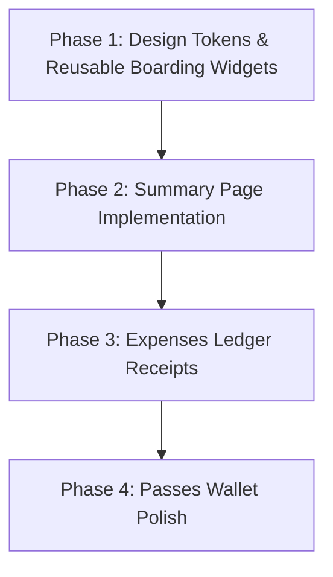

# Trip Tracker 2026 — Complete UI/UX Evolution Suite & Implementation Plan

This document presents the complete **Aviation Boarding Pass & Travel FinTech** visual system across the primary screens of **Trip Tracker**, followed by a phased engineering implementation plan.

---

## Part 1: Visual Design Suite

### 1. Summary Page (Combined Boarding Pass & Ledger)

#### Visual Hierarchy:
1. **Hero Boarding Card:** Twilight landscape banner fades into an obsidian ticket body (`#0C141E`).
2. **Tactile Perforated Notches:** Physical circular scalloped cutouts along the horizontal tear-line.
3. **Traveler Net Position:** Glowing high-contrast balance (`+₹14,850 YOU ARE OWED`) with a red rubberized `NOT SETTLED` stamp.
4. **Flight Clearance Runway:** Airplane marker gliding along a runway progress track (`68% CLEARED`).
5. **Smart Debt Simplification:** Integrated toggle (*"3 transfers settle all debts"*) with perforated luggage claim settlement stubs (`Rahul ➔ You: ₹8,400`) and amber-gold **Settle** action buttons.
6. **Trip Numbers Category Donut:** Neon-glow segmented donut chart showing spend breakdown (Stay, Dining, Transit, Activities) and "Who Paid" contribution bars.

---

### 2. Expenses Page (Aviation Receipt Ledger)

#### Visual Hierarchy:
1. **Filter Runway:** Quick horizontal pill chips (`All Expenses`, `Dining`, `Stay`, `Transit`, `Activities`) with active teal glow.
2. **Day Group Headers:** Monospace airline departure labels (`OCT 14 · DAY 3 · ₹18,400 Total`).
3. **Boarding Receipt Expense Cards:**
   - Soft glow category icons (coral for Dining, blue for Stay, teal for Transit).
   - Card title with payer & participant count (`Paid by Alex · Split with 5`).
   - High-contrast amount with personal share subtitle (`Your share: ₹1,360` or `You get back ₹19,200`).
   - Perforated notch tear-line on the card edge with authentic micro barcode graphic.

---

### 3. Passes & Notes Page (Digital Travel Wallet)

#### Visual Hierarchy:
1. **Segmented Pill Selector:** High-contrast capsule toggle (`Passes (2)`, `Checklist (8)`, `Notes`).
2. **Airline Boarding Pass Card:**
   - Flight routing (`DEL ✈ GOI`, `14:15 ➔ 16:45`), flight number (`INDIGO 6E-204`).
   - Passenger details in uppercase monospace (`RAHUL MAURYA`, `SEAT 4F`, `GATE 12A`, `ZONE 2`).
   - Vertical scalloped perforation separating the main ticket from the scannable QR code stub.
3. **Stacked Hotel / Activity Passes:** Layered secondary stubs beneath the active pass.
4. **Packing Checklist Card:** Tactile, rounded-corner card with custom teal circular checkmarks.

---

## Part 2: Engineering Implementation Plan

To bring these designs into code cleanly and reliably, the work will be divided into modular, testable phases.

### Phase 1: Design Tokens & Reusable Boarding Widgets
Build isolated, reusable presentation components in Flutter (`flutter_app/lib/core/widgets/`):
- **`TicketScallopDivider`:** A custom `CustomPainter` widget that draws clean circular cutout notches on left/right edges with a dashed perforated line between them.
- **`BoardingPassCard`:** Shell widget supporting top atmospheric image banner, scalloped separator, and bottom stub.
- **`LuggageStubTile`:** Settlement ticket widget with friend avatars, dotted stitch borders, barcode graphic, and amber Settle action button.
- **`CategoryDonutChart`:** Custom animated radial arc chart with center total spend and legend badges.
- **`StatusStamp`:** Rotated rubberized stamp widget supporting `NOT SETTLED` (red/gold) and `ALL SETTLED` (green/wax).

### Phase 2: Summary Page Rebuild
Transform `flutter_app/lib/features/expenses/presentation/balances_tab.dart` (the Summary tab):
- Replace existing plain summary cards with `BoardingPassCard`.
- Integrate the net balance, dynamic rubberized stamp, and runway progress bar.
- Wire the debt settlement list into `LuggageStubTile` components with existing `calculateGroupLedger` and settle dialogs.
- Wire the category totals into `CategoryDonutChart`.
- Ensure dark, light, and AMOLED theme compatibility.

### Phase 3: Expenses Tab (Ledger Receipts)
Update `flutter_app/lib/features/expenses/presentation/expenses_tab.dart`:
- Restyle expense rows into boarding receipt cards with fine dotted stitch borders and category glow icons.
- Add personal share indicator pills (`Your share: ₹X` / `You get back: ₹Y`).
- Update day-group headers to airline flight-log styling.

### Phase 4: Passes & Wallet Polish
Update `flutter_app/lib/features/notes/presentation/notes_tab.dart`:
- Refine `PassCard` with authentic vertical scalloped perforation and QR code stub.
- Refine checklist rows with teal circular checkmarks and smooth strikethrough animations.

---

## Part 3: Architecture & Safety Principles
1. **Zero Data/Logic Regressions:** All existing calculations (`simplify-debts`, `calculateGroupLedger`, outbox sync) remain untouched; only presentation widgets are upgraded.
2. **Full Test Coverage:** Unit test all custom painters and widget tests for the new UI surfaces.
3. **Clean Versioning & Git Commits:** Log ADR 286, bump version, and pass all local builds before any commit.
