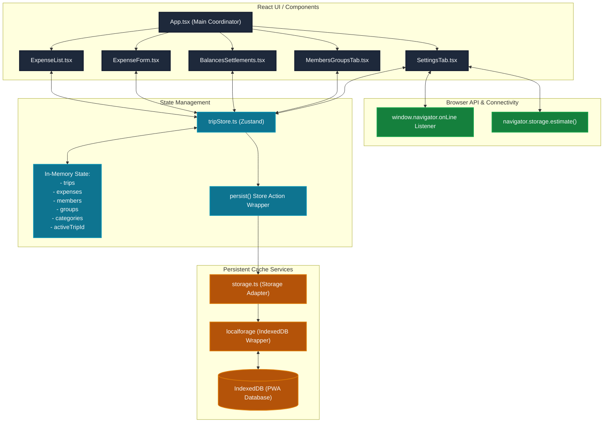
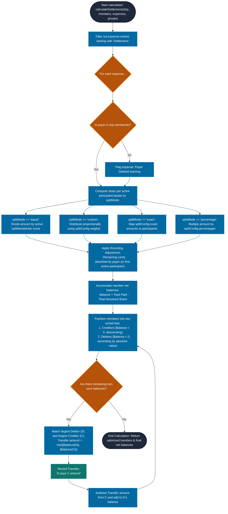
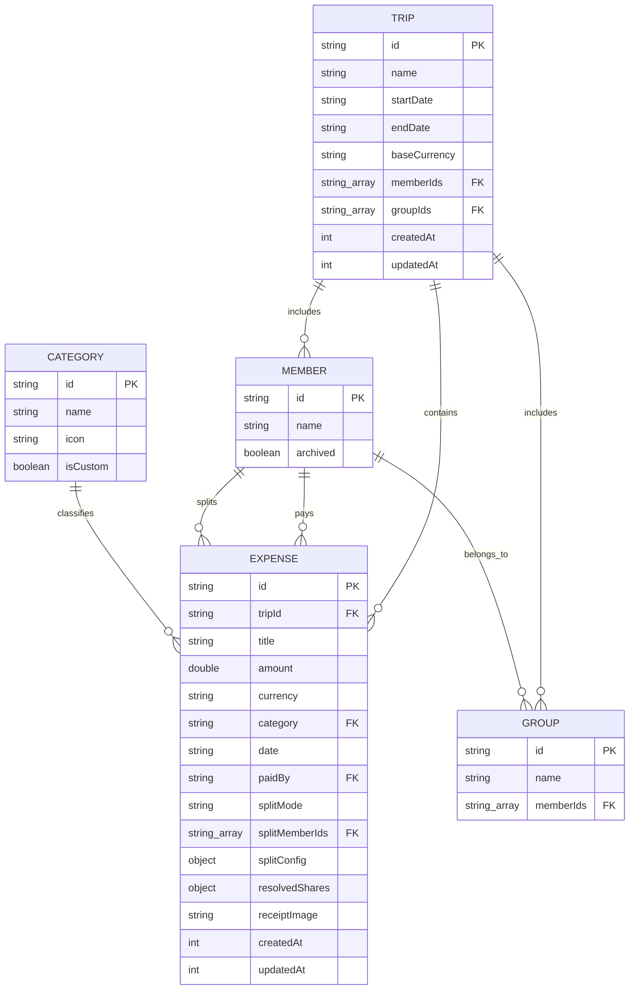

# Trip Tracker 2026 — Architecture & Data Diagrams

This directory contains key system design diagrams and architectural flows for **Trip Tracker 2026**.

These diagrams are written in **Mermaid** syntax. You can view them rendered interactively directly inside GitHub, VS Code (using a Markdown preview extension), or by copying the source to any Mermaid editor online.

---

## 1. Application Architecture & Data Sync Flow

Describes how user interactions flow through the UI layer to update the Zustand global store state, which then persists changes asynchronously through the storage adapter (`localforage` wrapper) to IndexedDB.

Source file: [app_architecture.mmd](app_architecture.mmd)

---

## 2. Settlements & Net Balances Calculation Engine

Outlines the pipeline that filters active expenses, resolves shares using different split modes (Equal, Custom weights, Exact amounts, and Percentages), performs rounding correction, and optimizes cash transfers using a greedy settlement matching algorithm.

Source file: [settlements_engine.mmd](settlements_engine.mmd)

---

## 3. Data Model ER Diagram

Documents entity attributes and relationships within the database schema.

Source file: [data_model.mmd](data_model.mmd)
