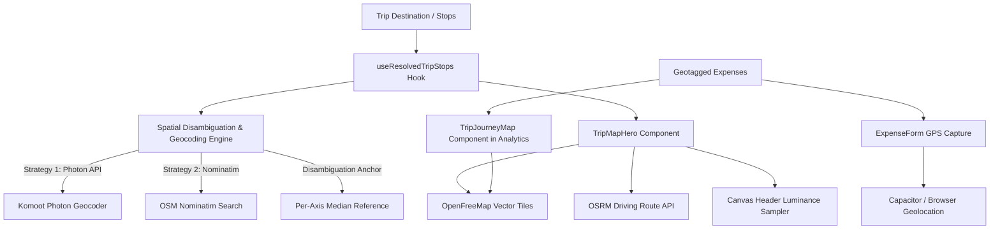

# Mapping System Architecture & Implementation Reference

This document provides a comprehensive technical overview of the mapping, geocoding, routing, and geolocation infrastructure implemented in **Trip Tracker 2026**.

---

## 1. High-Level Architecture

The mapping system provides interactive, vector-rendered geospatial visualizations across the app:
1. **Interactive Full-Screen Trip Backdrop (`TripMapHero`)**: Dynamic map canvas pinned behind the trip dashboard header, displaying destination stops, road paths, and ambient luminance adaptation.
2. **Expense Journey Map (`TripJourneyMap`)**: Chronological travel trail in the Analytics tab, charting geotagged expenses with category emojis and spend popups.
3. **Spatial Disambiguation & Geocoding Engine (`geolocation.ts` & `useResolvedTripStops.ts`)**: Multi-tier forward/reverse geocoding and median-anchor spatial disambiguation.
4. **Offline-First / Zero-API-Key Infrastructure**: Powered by MapLibre GL, OpenFreeMap vector tiles, OSRM road routing, and Komoot Photon / OSM Nominatim.



---

## 2. Core Technologies & Service Providers

| Component | Technology / Service | Key Rationale & Characteristics |
|---|---|---|
| **Map Rendering Engine** | [MapLibre GL JS](https://maplibre.org/) (`maplibre-gl`) | GPU-accelerated WebGL vector rendering; lightweight open-source fork of Mapbox GL; smooth gestures, dynamic rotation, and crisp HiDPI typography. |
| **Vector Tile Provider** | [OpenFreeMap](https://openfreemap.org/) (`styles/liberty`) | Free, open-source vector tile CDN with zero API keys required, zero rate limits, high uptime SLA, and full CORS support. |
| **Road Routing Engine** | [Project-OSRM](https://project-osrm.org/) (`router.project-osrm.org`) | Keyless public routing service that calculates realistic driving geometries following highway networks between trip stops. |
| **Forward Geocoder (Primary)** | [Komoot Photon API](https://photon.komoot.io/) | Elasticsearch-powered OpenStreetMap geocoder; sub-100ms response times, open CORS, zero rate limits. |
| **Forward & Reverse Geocoder (Secondary)** | [OpenStreetMap Nominatim](https://nominatim.openstreetmap.org/) | Detailed fallback geocoder and reverse-geocoding engine for converting GPS fixes to human-readable district/city names. |
| **Device GPS Bridge** | `@capacitor/geolocation` + `navigator.geolocation` | Unified abstraction across iOS, Android, and Web browsers with permission handling and safety timeouts. |

---

## 3. Web Worker Build & Packaging Pipeline

### The Relative Worker Resolution Problem
MapLibre GL instantiates a background Web Worker (`maplibre-gl-worker.js`) to parse vector tiles and decode PBF binaries off the main UI thread. In development, Vite serves this via standard ES module resolution. However:
1. In production builds and mobile app containers (Capacitor), single-file bundling breaks relative sibling imports (specifically `import "./maplibre-gl-shared.mjs"`).
2. Certain static servers (e.g. Nginx on EC2 or local asset bridges) serve `.mjs` files without the `text/javascript` MIME type (often defaulting to `application/octet-stream`), causing browsers to reject the worker script.

### Solution: `scripts/sync-maplibre-worker.mjs`
To ensure 100% reliability across Web, PWA, iOS, and Android:
- A pre-build sync script copies `maplibre-gl-worker.mjs` and `maplibre-gl-shared.mjs` directly from `node_modules/maplibre-gl/dist` into `public/maplibre/`.
- File extensions are rewritten from `.mjs` to `.js`, and the internal import path inside the worker is modified to `./maplibre-gl-shared.js`.
- In both `TripMapHero.tsx` and `TripJourneyMap.tsx`, the worker URL is explicitly registered:
  ```typescript
  setWorkerUrl(`${import.meta.env.BASE_URL}maplibre/maplibre-gl-worker.js`);
  ```

---

## 4. Component Implementations

### A. `TripMapHero.tsx` (Dashboard Hero Backdrop)
* **File:** [`src/components/TripMapHero.tsx`](file:///c:/ProjectsV1/Trip_Tracker_2026/src/components/TripMapHero.tsx)
* **Mount Location:** Fixed full-screen backdrop behind the main dashboard in [`src/App.tsx`](file:///c:/ProjectsV1/Trip_Tracker_2026/src/App.tsx).

#### Key Features:
1. **Multi-Stop Route Lines & Glow:**
   - Immediately renders a straight dashed GeoJSON `LineString` between all resolved stops with a teal background glow (`#0F6F63`).
   - Asynchronously queries OSRM (`fetchRoadRoute`) for actual highway turn-by-turn geometry.
   - Once road geometry arrives, seamlessly updates the GeoJSON source and refits the viewport over the expanded road bounds.
2. **Numbered Waypoint Badges:**
   - Start stop: Teal marker (`#0F6F63`).
   - End stop: Orange marker (`#FF7A00`).
   - Intermediate stops: Slate dark marker (`#16181D`).
3. **Dynamic Header Luminance Sampling (`sampleHeaderLuminance`):**
   - Initializes MapLibre with `preserveDrawingBuffer: true`.
   - Samples the top 150px of the rendered WebGL canvas via a 16×8 downsampled 2D canvas context.
   - Calculates relative luminance: `0.299*R + 0.587*G + 0.114*B`.
   - Fires `onToneChange('dark' | 'light')` to dynamically adjust header button contrast (dark vs light text) based on whether the underlying map tile is bright sand/snow or dark ocean/terrain.
   - Runs on `idle` and throttled `render` (200ms interval) for fluid transitions during gestures.
4. **Sheet Expansion Interaction:**
   - Listens to bottom-sheet gesture state (`sheetExpanded`) and applies a subtle camera ease-out (`-0.6` zoom delta) to create an organic visual depth cue when opening panels.

---

### B. `TripJourneyMap.tsx` (Analytics Tab Journey Map)
* **File:** [`src/components/TripJourneyMap.tsx`](file:///c:/ProjectsV1/Trip_Tracker_2026/src/components/TripJourneyMap.tsx)
* **Mount Location:** Embedded within [`src/components/AnalyticsTab.tsx`](file:///c:/ProjectsV1/Trip_Tracker_2026/src/components/AnalyticsTab.tsx).

#### Key Features:
1. **Chronological Trail:**
   - Filters out deleted or unresolved expenses, sorting by expense date and creation time.
   - Draws a connected turquoise dashed line across all visited locations.
2. **Interactive Category Emoji Pins:**
   - Marker icons use the category's assigned emoji icon (e.g. 🍕, 🏨, 🚕, 🎟️) with a blue/teal badge style.
3. **HTML Popups with XSS Defense:**
   - Displays expense title, formatted currency amount (`privacy-blur` compliant), timestamp, stop index, and reverse-geocoded place name.
   - All dynamic strings are strictly sanitized via [`escapeHtml`](file:///c:/ProjectsV1/Trip_Tracker_2026/src/components/TripJourneyMap.tsx#L37-L48).
4. **Zero-Height Tab Sizing Fix (`ResizeObserver`):**
   - Because the Analytics tab is toggled via `display: none`, tabs opened for the first time can have a 0×0 viewport when MapLibre measures its canvas.
   - An attached `ResizeObserver` triggers `map.resize()` automatically whenever the tab becomes visible.

---

## 5. Geocoding & Spatial Disambiguation Engine

* **Files:** [`src/utils/geolocation.ts`](file:///c:/ProjectsV1/Trip_Tracker_2026/src/utils/geolocation.ts) & [`src/hooks/useResolvedTripStops.ts`](file:///c:/ProjectsV1/Trip_Tracker_2026/src/hooks/useResolvedTripStops.ts)

### A. Destination Parsing
If a trip does not have explicit structured stops (`trip.stops`), the hook extracts destination segments from strings like `"Paris → Lyon → Nice"`, `"Goa, Mumbai, Delhi"`, or `"Rome - Florence"` using regex delimiter splitting:
```typescript
const parts = trip.destination.split(/[→\->,/|]/).map((p) => p.trim()).filter(Boolean);
```

### B. Multi-Stop Spatial Disambiguation (`resolveTripStopCoordinates`)
When a user types a common place name (e.g., *"Pelling"* which exists in both Sikkim, India and Germany, or *"San Jose"* in California vs Costa Rica vs Philippines), naive geocoding can select the wrong continent.

**The Solution:**
1. **Candidate Retrieval:** Queries all stops concurrently using Photon / Nominatim.
2. **Median Anchor Calculation:**
   - Instead of calculating an arithmetic mean (which can be dragged thousands of miles by a single outlier candidate), the engine calculates the **per-axis median latitude and median longitude** of the top candidates.
3. **Proximity Ranking:**
   - Ranks all candidate coordinates by squared Euclidean distance to this median anchor.
4. **Device Location Tie-Breaking:**
   - If the top two candidates are within a `1.2×` distance ratio (`TIE_BREAK_RATIO`), the device's current GPS location is used to break the tie.
   - For single-stop trips (where no multi-stop median exists), current device GPS serves as the primary disambiguation anchor.

```typescript
// Spatial Disambiguation Median Anchor
const reference = {
  lat: median(naivePicks.map((p) => p.lat)),
  lng: median(naivePicks.map((p) => p.lng)),
};
```

---

## 6. Expense Geotagging Flow

1. **User Adds Expense:**
   - In [`ExpenseForm.tsx`](file:///c:/ProjectsV1/Trip_Tracker_2026/src/components/ExpenseForm.tsx), if `enableGeotagging` is enabled in Settings, [`captureCurrentExpenseLocation()`](file:///c:/ProjectsV1/Trip_Tracker_2026/src/utils/geolocation.ts#L232) is invoked.
2. **GPS Fix Acquisition:**
   - Queries GPS coordinates with a strict 4000ms race timeout to prevent UI hangs.
3. **Reverse Geocoding:**
   - Fetches human-readable address hierarchy from OSM Nominatim (suburb, city, state, country).
   - Results are stored in memory in `geocodeCache` to minimize network overhead.
4. **Persistence:**
   - Saved with the expense object under `expense.location: { lat, lng, placeName }`.

---

## 7. Security & Performance Guardrails

1. **Zero External API Keys:**
   - No Google Maps or Mapbox API keys required. Eliminates quota lockouts, billing surprises, and leaked client key vulnerabilities.
2. **XSS Protection:**
   - All user inputs in map popups and tooltip overlays are escaped using `escapeHtml`.
3. **Graceful Degradation:**
   - If offline or geocoding times out, the app falls back to raw coordinate strings (`"15.299°, 74.124°"`) and straight-line geometries without throwing errors.
4. **Performance & Memory Hygiene:**
   - Map instances and markers are cleanly unmounted and destroyed in `useEffect` cleanup return functions.
   - Tile rendering is hardware-accelerated via WebGL canvas contexts.
