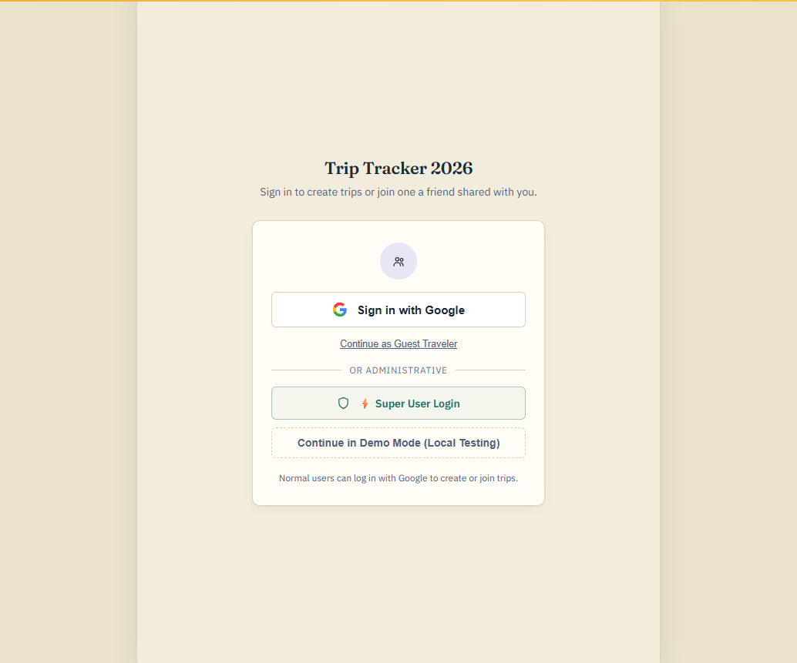
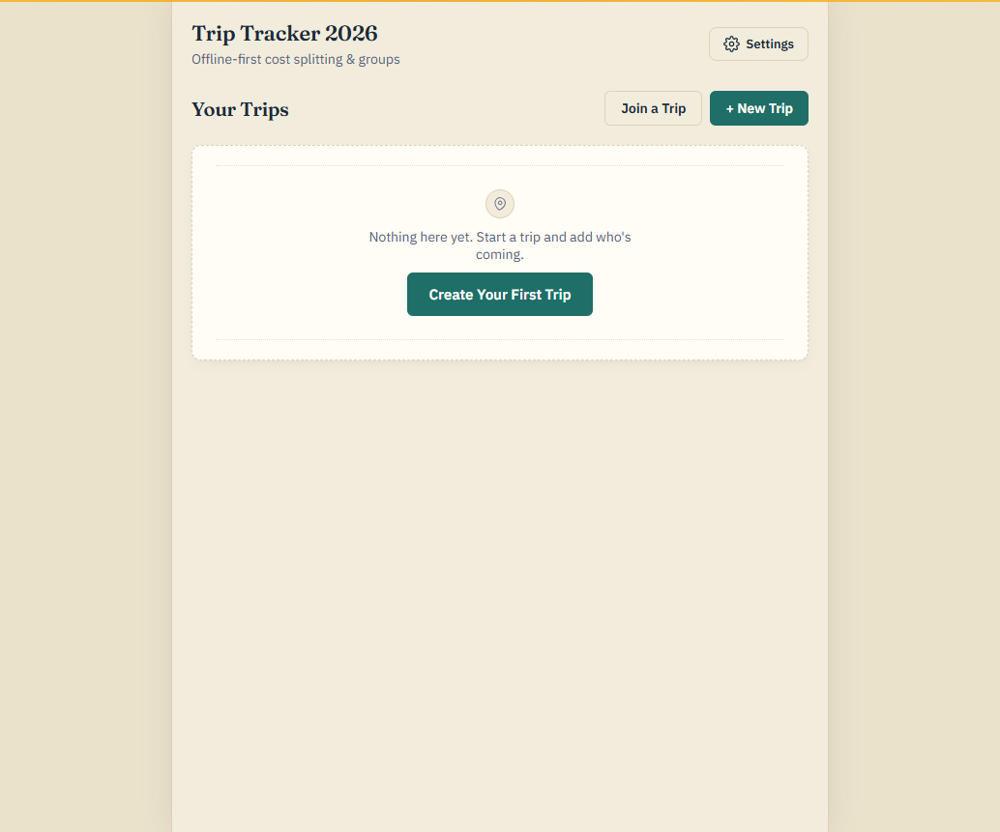
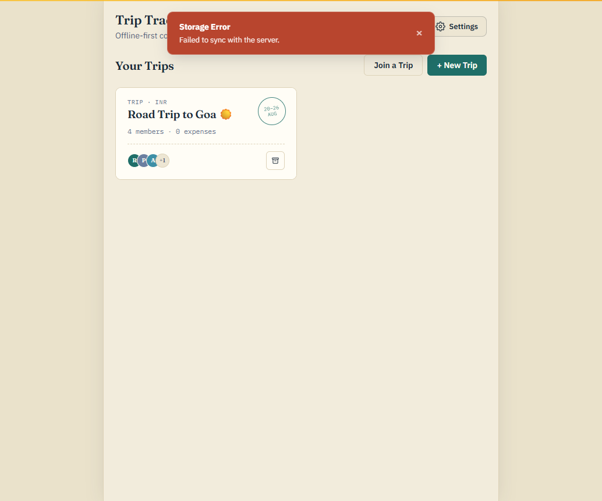
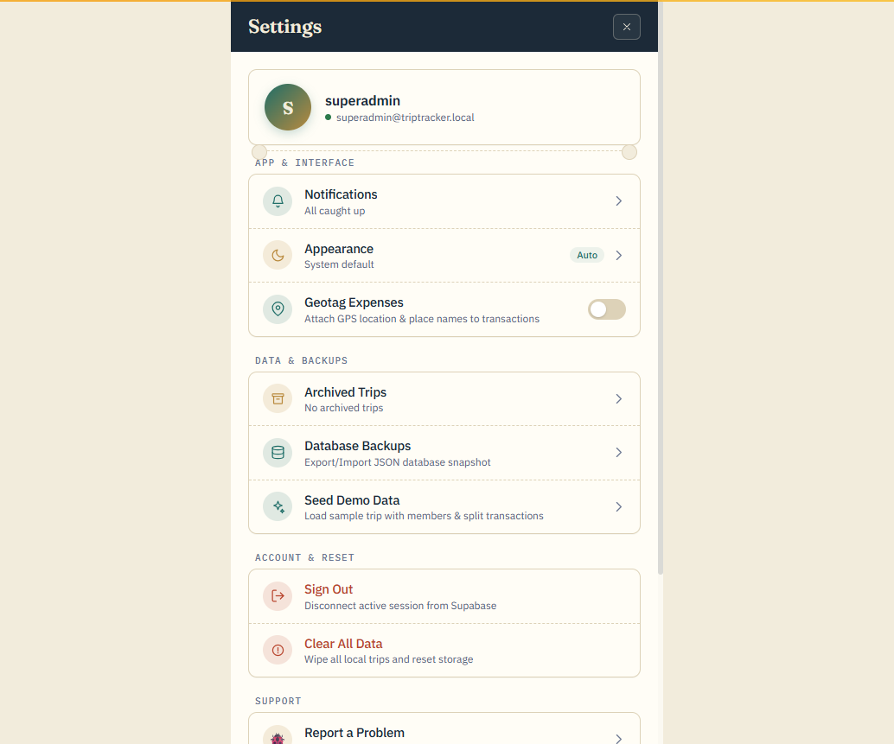
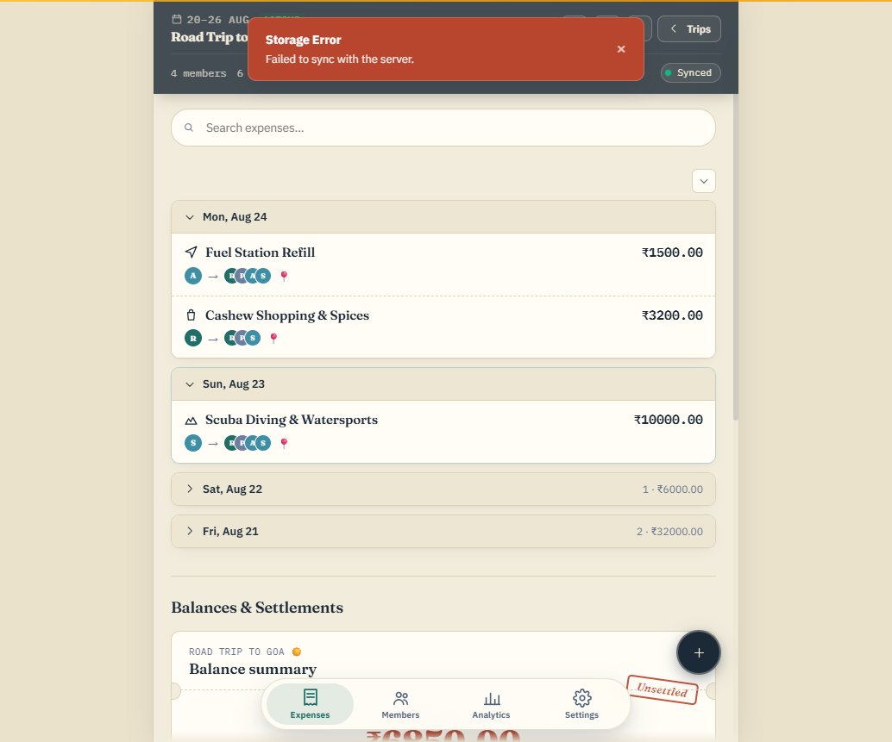
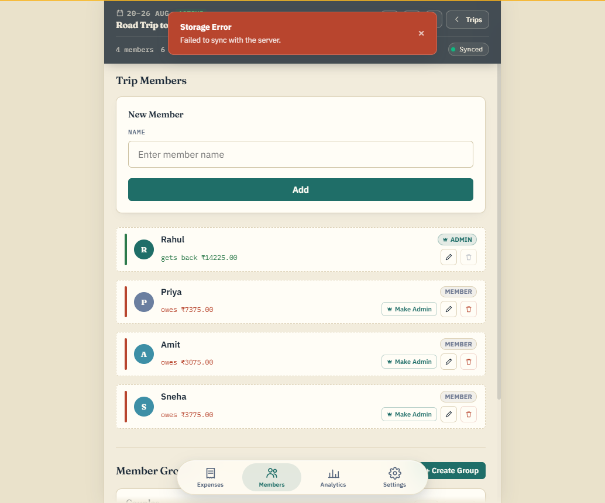
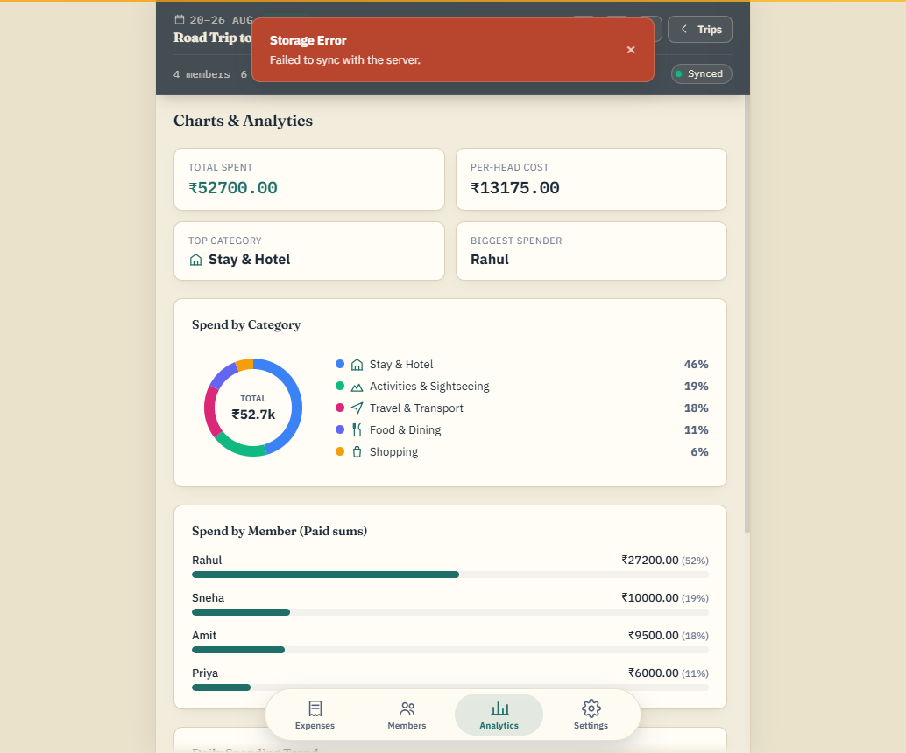

# UI Before the `material-ui` Redesign

Captured from `main` immediately before merging the `material-ui` branch, for
reference. This is what the app looked like before the header/map/boarding-pass
rework, the neutral-teal theme pass, and the superadmin user-delete feature.

## Login

Google / Guest / Demo Mode / Super User Login. No corner superadmin shield
entry point yet — that was added on `material-ui`.

## Trips Home — Empty State

## Trips Home — With a Trip

## App Settings

Flat list, no superadmin gating on Database Backups / Seed Demo Data / Clear
All Data — any signed-in user could see and use them here. `material-ui`
restricts those three to superadmin.

## Trip Dashboard — Expenses / Balances

Plain list layout: search bar, category/member filter chips, day-grouped
expense list, Suggested Settlements, Member & Group Balances. No live map
backdrop, no draggable sheet, no boarding-pass balance card — those are all
`material-ui` additions.

## Members & Groups

## Analytics

