# Trip Tracker 2026: Superadmin Architecture & Governance

This document describes the dual-role architecture, the dedicated administrative "Ops Deck" portal, real authentication, and governance controls in **Trip Tracker 2026**.

---

## 1. System Architecture Overview

```mermaid
graph TD
    A[Initial Entry / Login Screen] -->|Google Sign-In| B[Normal Traveler App]
    A -->|Super User Login button| C[Superadmin Ops Deck]

    subgraph "Normal Traveler Application (Minimal & Private)"
        B --> B1[Trips Browser & Creator]
        B --> B2[Expense Logging & 200+ Brand Auto-Tagging]
        B --> B3[1-Tap Basic GPS Geotagging]
        B --> B4[Group Member Management & Net Settlements]
        B --> B5[Active Trip Analytics & Journey Map]
        B --> B6[Settings: Report a Problem / Suggest a Feature]
    end

    subgraph "Superadmin Ops Deck (code-split, superadmin-only)"
        C --> D1[SEC.01 Flags -- flag toggles + fleet controls]
        C --> D2[SEC.02 Analytics -- fleet-wide KPIs]
        C --> D3[SEC.03 Trips -- directory, freeze/archive/delete, Inspect]
        C --> D4[SEC.04 Users -- suspend, broadcast]
        C --> D5[SEC.05 Audit -- security_audit_logs viewer]
        C --> D6[SEC.06 Features -- triage feature requests]
        C --> D7[SEC.07 Tools -- keyword rules, backup, danger zone]
    end
```



On mobile (<760px), the section rail is replaced by a tappable "current section" status-line that opens a full-screen switcher -- not a sidebar reflow. See [`CHANGELOG.md`](CHANGELOG.md) (2026-08-21 entry) for why two earlier mobile-nav attempts (horizontal scroll, then a wrapping grid) were replaced -- no dedicated explanation doc exists for this yet (documentation gap; a candidate for `/document-generate`).

---

## 2. Role Separation & Boundary Specifications

### A. Normal Customers / Travelers
- **Access Method**: Google Sign-In.
- **Privacy & Isolation**: Trips and member rosters are private to their respective group participants (RLS-enforced, not just UI-hidden). A suspended account (see Users tab) loses read/write access to every trip immediately, mid-session.
- **Allowed Actions**:
  - Create and join trips (join code).
  - Log expenses with automatic category tagging across 200+ brands and keywords.
  - Basic 1-tap GPS location capture (flag-gated).
  - Manage group members and custom groups for their own trips.
  - View net balances and execute debt settlements.
  - View active trip analytics (category breakdown, spend shares, route journey map).
  - Report a bug or suggest a feature from Settings (Suggest a Feature is flag-gated, off by default -- see §3.1).

### B. Superadmin
- **Access Method**: Real Supabase Auth account (email/password), authorized by being listed in `public.superadmins`. There is no shared or hardcoded credential -- see §4.
- **Portal Shell**: A separate, code-split "Ops Deck" application (`AdminPortalLayout.tsx`) with 7 sections.

---

## 3. Ops Deck Sections

### SEC.01 Flags (`AdminFlagsPage.tsx`)
- **Feature flag switchboard** -- live toggles for:
  - `enableGeotagging`, `enableAdvancedLocationSearch`, `enableAdvancedSplits`, `enableP2PSync`, `enableReceiptUpload`, `enableRecycleBin`, `enableKeywordTagging`, `enableDemoSeeding`, `enableMultiTripAnalytics`
  - `enableFeatureSuggestions` -- gates the Settings "Suggest a Feature" entry point itself. Off by default; enable globally, per-trip, or for one specific person via a User Override.
- **3-tier hierarchy resolution**: Superadmin bypass (always ON) → User Override → Trip Override → Global Flag → Default.
- **Cross-device, not per-browser**: flags/overrides are backed by `public.feature_flag_overrides` (migration 0064) and resolved server-side via `get_resolved_feature_flags()`. Earlier in this table's life, toggles only ever updated the admin's own browser's localStorage and never reached other devices -- that was fixed; see `docs/explanation-navigation-and-offline-fixes.md` for the class of bug and BUG-029 in `BUGS.md`.
- **Fleet Controls** (`app_config`-backed, separate from the flag grid above): maintenance mode (+ a scheduled window), paused sign-ins, join-code rate limits, recycle-bin retention hours, expense amount ceiling, audit log retention days.

### SEC.02 Analytics (`AdminAnalyticsPage.tsx`)
Fleet-wide KPIs and trend views: total volume, category/currency breakdowns, top spenders, growth trend (signups), day-of-week activity heatmap, settlement health, split-mode and feature adoption rates, bug-report origin (auto-crash vs manual), notification delivery (aggregate sent/read, no message content exposed), recycle-bin snapshot count, platform split (iOS/Android device counts).

### SEC.03 Trips (`AdminTripsPage.tsx`)
Search + status filter (All/Active/Grounded/Archived). Per trip: **Inspect** (opens the trip in the traveler UI using the superadmin's own already-elevated access -- not per-user impersonation, since that would require the `service_role` key in the browser, which never belongs there), **Ground/Unground** (freeze), **Archive/Restore**, **Delete**.

### SEC.04 Users (`AdminUsersPage.tsx`)
Full account directory. **Suspend/Restore** -- enforced via `is_banned()` wired into `is_trip_participant()`/`is_trip_admin()`, so it blocks a user everywhere in one gate, works mid-session, and can never target a superadmin account. **Broadcast notification** -- send to everyone or scope to one trip.

### SEC.05 Audit (`AdminAuditPage.tsx`)
Reads `public.security_audit_logs` (existed since migration 0048 but nothing wrote to it until this was built -- `log_security_event()` is now called from every sensitive superadmin RPC: suspend/restore, broadcast, recycle-bin purge, config changes). Configurable retention (default 90 days), manual purge, nightly `pg_cron` sweep.

### SEC.06 Features (`AdminFeaturesPage.tsx`)
Mirrors the Bug Ledger's architecture for feature requests instead of defects (`public.features`, migration 0063). Any traveler can submit via Settings → Suggest a Feature (when `enableFeatureSuggestions` is on for them); superadmin triages (Requested → Planned → In Progress → Shipped / Won't Do). A request can be linked to an *existing* `FeatureFlagKey` for a one-click enable/disable right on its row -- this can only link a flag already wired into the app's code, it cannot retroactively create working on/off control for something nothing checks yet. See [`FEATURES.md`](FEATURES.md) for the CLI-mirrored log (`npm run feature -- add/list/ship/sync`).

### SEC.07 Tools (`AdminToolsPage.tsx`)
200+ keyword/brand auto-tagging rule editor, JSON database backup/restore, demo dataset seeder, fleet-wide CSV export, on-demand recycle-bin purge, and the danger-zone full wipe.

---

## 4. Superadmin Authentication

There is **no shared or hardcoded credential**. A superadmin is any account whose `user_id` is listed in `public.superadmins` -- a table with zero RLS policies for `anon`/`authenticated` (not even a superadmin can `SELECT` it directly from the client); only `service_role` can insert a row, and only `get_superadmin_ids()` (a `SECURITY DEFINER` RPC, superadmin-gated) exposes the list back to the Ops Deck's own UI.

Login flow: **⚡ Super User Login** on the login screen → real `supabase.auth.signInWithPassword()` → the client then calls the `is_superadmin()` RPC; the Ops Deck only renders if that returns true. A correct password alone is not enough -- any registered user could type their own real credentials, so the RLS-side check is what actually gates access.

Granting/revoking superadmin status is a `service_role`-only operation (Supabase SQL editor or the migration scripts), deliberately outside the app's own UI.

---

## 5. File Structure Reference

```
src/
├── components/
│   ├── admin/                          # Code-split -- never shipped to a traveler's bundle
│   │   ├── AdminPortalLayout.tsx       # Master Ops Deck shell, section nav, mobile switcher
│   │   ├── AdminFlagsPage.tsx          # SEC.01 Flags + Fleet Controls
│   │   ├── AdminAnalyticsPage.tsx      # SEC.02 Analytics
│   │   ├── AdminTripsPage.tsx          # SEC.03 Trips
│   │   ├── AdminUsersPage.tsx          # SEC.04 Users
│   │   ├── AdminAuditPage.tsx          # SEC.05 Audit
│   │   ├── AdminFeaturesPage.tsx       # SEC.06 Features
│   │   ├── AdminToolsPage.tsx          # SEC.07 Tools
│   │   └── ops-deck.css                # Ledger Ops visual system (light/dark, mobile-first)
│   ├── LoginScreen.tsx                 # Google Sign-In + Super User Login entry
│   ├── SuperadminAuthModal.tsx         # Real password auth + is_superadmin() check
│   ├── FeatureRequestModal.tsx         # Settings > Suggest a Feature (flag-gated)
│   ├── BugReportModal.tsx              # Settings > Report a Problem
│   └── SettingsView.tsx                # Traveler settings + superadmin entry points
├── types/
│   ├── admin.ts                        # FeatureFlagKey, AppConfigKey, AuditLogEntry, etc.
│   └── database.ts                     # Supabase schema mirror (tables + RPC signatures)
├── utils/
│   └── featureFlags.ts                 # FEATURE_FLAGS_META + isFeatureActive() resolution
├── services/
│   ├── tripApi.ts                      # Fleet-wide fetches, app_config, audit logs, etc.
│   ├── featureFlagApi.ts               # get/set feature flag overrides (migration 0064)
│   ├── bugApi.ts / featureApi.ts       # Bug Ledger / Feature Tracker CRUD
└── store/
    ├── authStore.ts                    # Supabase OAuth + superadmin session state
    └── tripStore.ts                    # Zustand store: flags, overrides, admin state
scripts/
├── bug.mjs                             # Bug Ledger CLI (mirrors the Supabase table)
└── feature.mjs                         # Feature Tracker CLI (mirrors the Supabase table)
supabase/migrations/
├── 0054-0059                           # Superadmin identity, Bug Ledger, RLS hardening
├── 0060-0062                           # Analytics/Audit/Users backend, app_config
├── 0063                                # Feature Tracker table + submit_feature_request()
└── 0064                                # feature_flag_overrides (cross-device flags)
```
