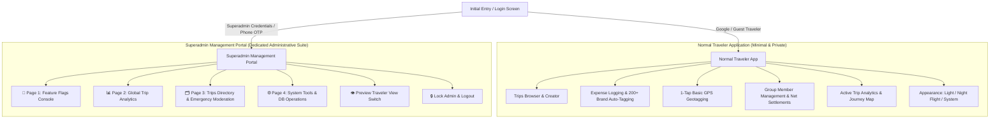

# Trip Tracker 2026: Superadmin Architecture & Governance

This document describes the dual-role architecture, dedicated administrative portal, security credentials, and emergency governance controls in **Trip Tracker 2026**.

---

## 1. System Architecture Overview



```
                          ┌───────────────────────────┐
                          │    Login Entry Point      │
                          │   (Google / Superadmin)   │
                          └─────────────┬─────────────┘
                                        │
                 ┌──────────────────────┴──────────────────────┐
                 ▼                                             ▼
  ┌─────────────────────────────┐               ┌─────────────────────────────┐
  │     Normal Traveler App     │               │ Superadmin Management Portal│
  │     (Clean & Minimal)       │               │      (Full Admin Suite)     │
  ├─────────────────────────────┤               ├─────────────────────────────┤
  │ • Add & Browse Trips        │               │ 🚩 Page 1: Flags Console    │
  │ • Log Expenses (Auto-Tag)   │               │ 📊 Page 2: Global Analytics │
  │ • Basic GPS Geotagging      │               │ 🗂️ Page 3: Trips Directory  │
  │ • Group Members & Balances  │               │ ⚙️ Page 4: System Tools     │
  │ • Settle Debts & CSV Export │               │ 👁️ Preview Traveler View   │
  │ • Light / Night Flight Mode │               │ 🔒 Lock Admin & Logout      │
  └─────────────────────────────┘               └─────────────────────────────┘
```

---

## 2. Role Separation & Boundary Specifications

### A. Normal Customers / Travelers
- **Access Method**: Google Sign-In or Local Guest Traveler session.
- **Privacy & Isolation**: Trips and member rosters are private to their respective group participants. Normal users cannot view or edit trips from other groups.
- **Allowed Actions**:
  - Create and switch trips.
  - Log expenses with automatic category tagging across 200+ brands and keywords.
  - Basic 1-tap GPS location capture.
  - Manage group members and custom groups for their own trips.
  - View net balances and execute debt settlements.
  - View active trip analytics (category breakdown, spend shares, route journey map).
  - Toggle light/dark appearance.

### B. Superadmin
- **Access Method**: Superadmin credentials or Authorized Phone OTP recovery.
- **Portal Shell**: Completely separate dedicated management application with 4 distinct top-level pages.

---

## 3. Dedicated Administrative Pages

### 🚩 Page 1: Feature Flags Console (`AdminFlagsPage.tsx`)
- **Global Feature Switchboard**: Live toggles for:
  - `enableGeotagging`: 1-tap GPS location tagging.
  - `enableAdvancedLocationSearch`: Search box typeahead with place autocomplete suggestions (*Taj Mahal, Baga Beach*).
  - `enableAdvancedSplits`: Weights, exact amounts, and percentage splits (hidden in minimal user mode by default).
  - `enableP2PSync`: Offline peer-to-peer sync diagnostics.
  - `enableReceiptUpload`: Receipt image camera capture and storage.
  - `enableRecycleBin`: 24-hour soft-delete recycle bin.
  - `enableKeywordTagging`: Keyword & brand customizer.
  - `enableDemoSeeding`: Sample dataset generator.
  - `enableMultiTripAnalytics`: Cross-trip aggregated insights.
- **3-Tier Hierarchy Resolution**:
  $$\text{Superadmin Bypass (Always ON)} \longrightarrow \text{User Override} \longrightarrow \text{Trip Override} \longrightarrow \text{Global Flag} \longrightarrow \text{Default}$$

---

### 📊 Page 2: Global High-End Trip Analytics (`AdminAnalyticsPage.tsx`)
- **Master Spend KPIs**: Aggregated financial volume across all trips combined, active trip count, total transactions, and traveler count.
- **Category Aggregate Breakdown**: Cross-trip spending distributions with percentage bars.
- **Top Spenders Leaderboard**: Top spenders ranked across all trips.
- **Multi-Currency Breakdown**: Total volume and transaction count segmented by currency (`USD`, `EUR`, `INR`, `GBP`, `JPY`, etc.).

---

### 🗂️ Page 3: Trips Directory & Governance (`AdminTripsPage.tsx`)
- **Group Isolation Enforcement**: All trips remain private to their members.
- **Search & Status Filters**: Filter by `All`, `Active`, `Frozen`, and `Archived`.
- **🛑 Emergency Freeze (Kill-Switch)**:
  - Tapping **"🛑 Freeze (Emergency Stop)"** immediately locks a problematic trip.
  - Normal members are blocked from adding, editing, or deleting transactions on a frozen trip, and a clear warning banner is displayed.
  - Superadmin can restore full active state with **"🔓 Unfreeze Trip"**.
- **Archive & Deletion**: Move trips to archive or permanently delete malicious data.

---

### ⚙️ Page 4: System Tools & DB Operations (`AdminToolsPage.tsx`)
- **200+ Keyword & Brand Auto-Tagging Rule Editor**:
  - Live chip cloud for each category.
  - Add custom keyword rules (e.g., matching `"zomato"`, `"uber"`, `"marriott"`, `"indigo"`).
  - Remove rules or restore category defaults.
- **Database Backup (JSON Export/Import)**: One-click export and restore.
- **Demo Dataset Seeder**: Generates sample trip *"Euro Summer 2026"* with transactions, locations, and members.
- **Danger Zone**: Wipe all local trips and reset database cache.

---

## 4. Superadmin Authentication & Recovery

| Property | Specification |
| :--- | :--- |
| **Login URL / Trigger** | `⚡ Super User Login` button on the initial login screen |
| **Admin Email** | `Superadmin@triptracker.com` |
| **Admin Password** | `Superadmin@triptracker.com` |
| **Authorized Recovery Phone 1** | `+91 7075762522` (Masked: `+91 7075***522`) |
| **Authorized Recovery Phone 2** | `+91 7977337757` (Masked: `+91 7977***757`) |
| **Recovery OTP (Demo/Offline)** | `849201` (Valid for 10 minutes) |

---

## 5. File Structure Reference

```
src/
├── components/
│   ├── admin/
│   │   ├── AdminPortalLayout.tsx      # Master administrative shell & navigation
│   │   ├── AdminFlagsPage.tsx         # 🚩 Page 1: Feature Flags Switchboard
│   │   ├── AdminAnalyticsPage.tsx     # 📊 Page 2: Global Cross-Trip Analytics
│   │   ├── AdminTripsPage.tsx         # 🗂️ Page 3: Trips Directory & Emergency Kill-Switch
│   │   └── AdminToolsPage.tsx         # ⚙️ Page 4: Keyword Rule Editor & DB Tools
│   ├── LoginScreen.tsx                # First page dual login (Google + Superadmin)
│   ├── SuperadminAuthModal.tsx        # Credentials auth & Phone OTP verification
│   └── SettingsView.tsx               # Minimal traveler settings + Superadmin portal link
├── types/
│   ├── admin.ts                       # FeatureFlagKey, FeatureFlagMeta, Admin types
│   └── index.ts                       # Trip (includes frozen flag), Member, Expense
├── utils/
│   ├── featureFlags.ts                # 3-Tier feature flag resolution engine
│   └── superadminAuth.ts              # Credential check & phone OTP recovery engine
└── store/
    ├── authStore.ts                   # Supabase OAuth + Superadmin session state
    └── tripStore.ts                   # Zustand store with admin state & freeze guards
```
